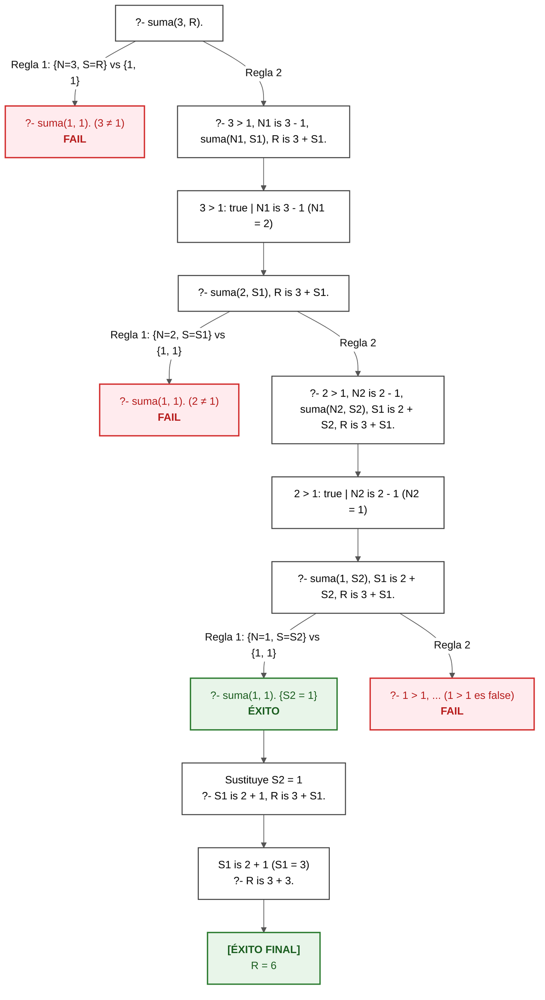

# Ejercicio 2: Suma Recursiva y Árbol SLD

## Árbol de Resolución SLD (`?- suma(3, R).`)

```mermaid
%%{init: {'theme': 'base', 'themeVariables': { 'primaryColor': '#ffffff', 'primaryBorderColor': '#333333', 'primaryTextColor': '#111111', 'lineColor': '#555555'}}}%%
flowchart TD
    %% Nodos principales
    Q1["?- suma(3, R)."]
    
    %% Nivel 1: bifurcación
    F1["?- suma(1, 1). (3 ≠ 1)<br/><b>FAIL</b>"]
    R1["?- 3 > 1, N1 is 3 - 1, suma(N1, S1), R is 3 + S1."]
    
    Q1 -->|"Regla 1: {N=3, S=R} vs {1, 1}"| F1
    Q1 -->|"Regla 2"| R1
    
    %% Evaluación aritmética nivel 1
    R1_eval["3 > 1: true | N1 is 3 - 1 (N1 = 2)"]
    Q2["?- suma(2, S1), R is 3 + S1."]
    
    R1 --> R1_eval
    R1_eval --> Q2
    
    %% Nivel 2: bifurcación
    F2["?- suma(1, 1). (2 ≠ 1)<br/><b>FAIL</b>"]
    R2["?- 2 > 1, N2 is 2 - 1, suma(N2, S2), S1 is 2 + S2, R is 3 + S1."]
    
    Q2 -->|"Regla 1: {N=2, S=S1} vs {1, 1}"| F2
    Q2 -->|"Regla 2"| R2
    
    %% Evaluación aritmética nivel 2
    R2_eval["2 > 1: true | N2 is 2 - 1 (N2 = 1)"]
    Q3["?- suma(1, S2), S1 is 2 + S2, R is 3 + S1."]
    
    R2 --> R2_eval
    R2_eval --> Q3
    
    %% Nivel 3: bifurcación final
    SUCCESS1["?- suma(1, 1). {S2 = 1}<br/><b>ÉXITO</b>"]
    F3["?- 1 > 1, ... (1 > 1 es false)<br/><b>FAIL</b>"]
    
    Q3 -->|"Regla 1: {N=1, S=S2} vs {1, 1}"| SUCCESS1
    Q3 -->|"Regla 2"| F3
    
    %% Desenrollado de la recursión
    U1["Sustituye S2 = 1<br/>?- S1 is 2 + 1, R is 3 + S1."]
    U2["S1 is 2 + 1 (S1 = 3)<br/>?- R is 3 + 3."]
    FINAL["<b>[ÉXITO FINAL]</b><br/>R = 6"]
    
    SUCCESS1 --> U1
    U1 --> U2
    U2 --> FINAL
    
    %% Clases de color para GitHub
    classDef fail fill:#ffebee,stroke:#d32f2f,stroke-width:2px,color:#b71c1c;
    classDef success fill:#e8f5e9,stroke:#2e7d32,stroke-width:2px,color:#1b5e20;
    classDef default fill:#ffffff,stroke:#424242,stroke-width:1.5px,color:#000000;
    
    class F1,F2,F3 fail;
    class SUCCESS1,FINAL success;
```
